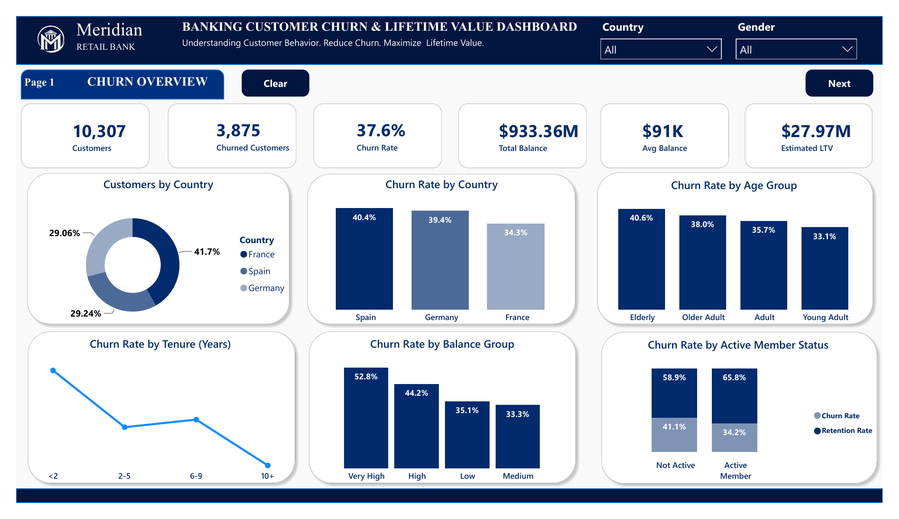
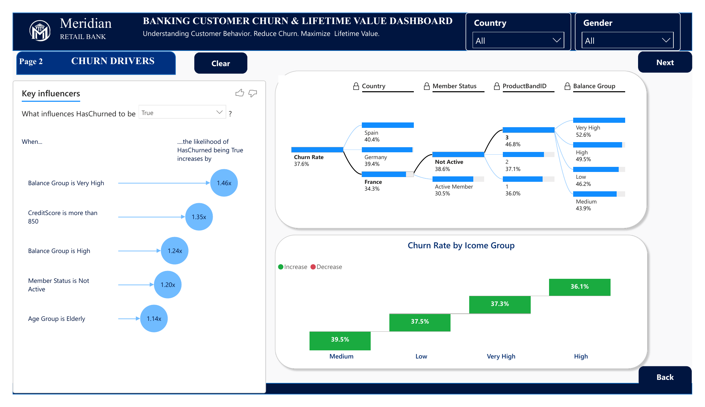
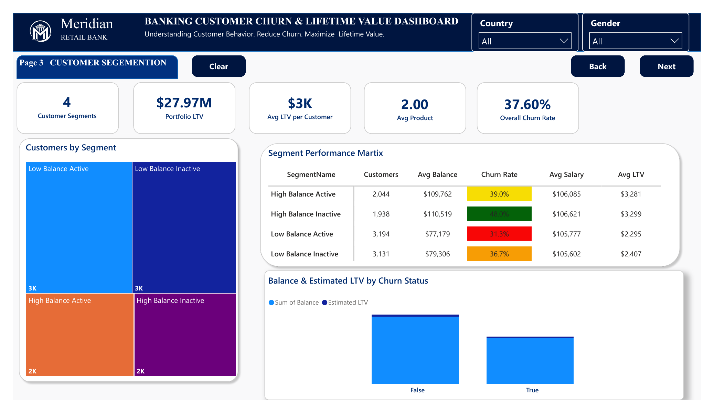
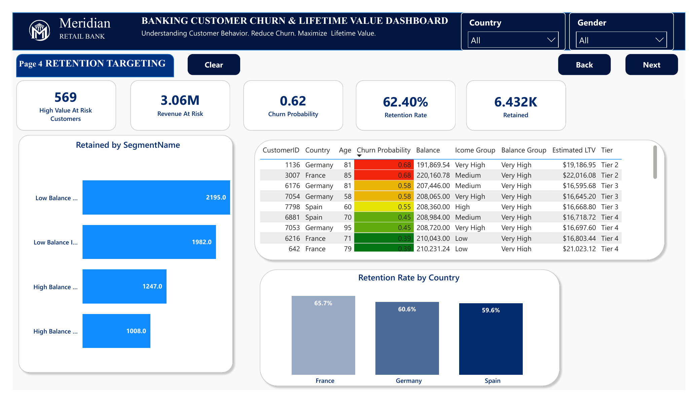
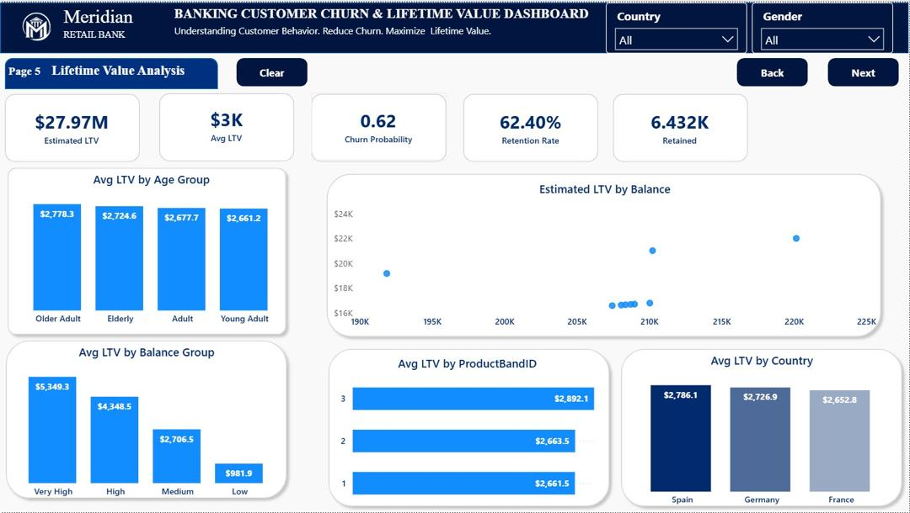
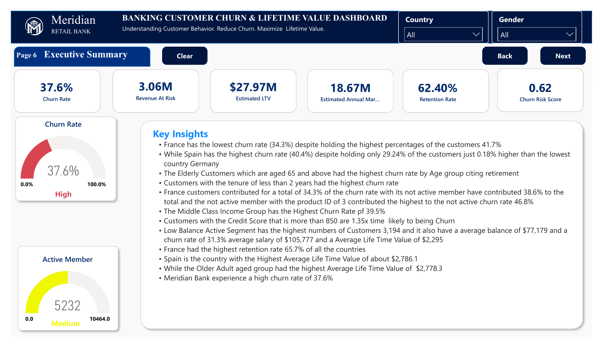
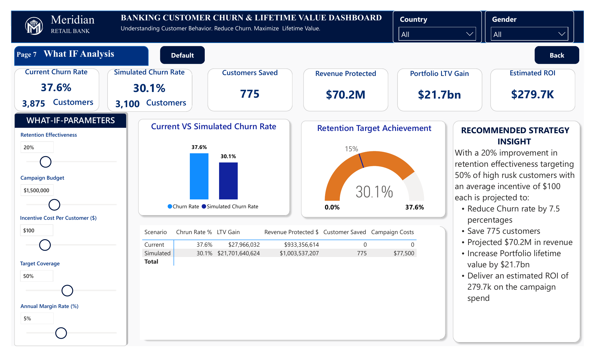

# Banking Customer Churn & Lifetime Value Dashboard
 
**Understanding Customer Behavior. Reduce Churn. Maximize Lifetime Value.**
 
Bank: **Meridian Retail Bank**
Tool: **Power BI Desktop**
 
---
 
## 📌 Project Overview
 
Customer churn is one of the most significant challenges facing retail banks, directly impacting revenue, profitability, and long-term growth. This project analyzes Meridian Retail Bank's customer data to understand **why customers leave**, **who is most likely to churn**, and **how much revenue is at risk** — while also identifying opportunities to maximize customer lifetime value (LTV) through targeted retention strategies.
 
Built in **Power BI**, the dashboard combines descriptive analytics, key-influencer driver analysis, customer segmentation, and an interactive **What-If retention simulator** to help decision-makers prioritize interventions with the highest financial impact.
 
---
 
## 🎯 Objectives
 
- Determine the overall customer churn rate and how it varies by country, age group, tenure, balance, and account activity status
- Identify the key factors driving churn using Power BI's Key Influencers analysis
- Segment customers into meaningful groups based on balance and activity status to uncover risk concentration
- Identify high-value, high-risk customers who should be prioritized for retention outreach
- Estimate each customer segment's lifetime value (LTV) to guide where retention investment pays off most
- Build a "What-If" simulator to model the financial impact of retention campaigns before committing budget
- Deliver an executive summary with clear, actionable insights for leadership
---
 
## 🗂 Dashboard Structure
 
The report is a 7-page interactive Power BI dashboard:
 
| Page | Description |
|------|-------------|
| **1. Churn Overview** | Headline KPIs and churn breakdowns by country, age group, tenure, balance group, and activity status |
| **2. Churn Drivers** | Power BI Key Influencers visual and decomposition tree identifying what most increases churn likelihood |
| **3. Customer Segmentation** | Four-quadrant segmentation (balance × activity) with a performance matrix comparing churn rate, salary, and LTV |
| **4. Retention Targeting** | Identifies high-value, at-risk customers ranked by churn probability, with revenue-at-risk quantified |
| **5. Lifetime Value Analysis** | Average LTV broken down by age group, balance group, product, country, and balance amount |
| **6. Executive Summary** | Gauge visuals and a written key-insights briefing summarizing the full analysis |
| **7. What-If Analysis** | Interactive retention campaign simulator — adjustable levers for effectiveness, budget, coverage, and margin |
 
All pages support global **Country** and **Gender** filters.
 
---
 
## 📊 Key Metrics (KPIs)
 
| Metric | Value |
|--------|-------|
| Total Customers | 10,307 |
| Churned Customers | 3,875 |
| Churn Rate | 37.6% |
| Total Balance | $933.36M |
| Average Balance | $91K |
| Estimated Portfolio LTV | $27.97M |
| Retention Rate | 62.40% |
| Churn Risk Score | 0.62 |
| Revenue At Risk | $3.06M |
| High-Value At-Risk Customers | 569 |
 
---
 
## 🔍 Key Findings
 
**Who is Churning**
- **Spain** has the highest churn rate (40.4%), despite holding only 29.24% of customers — just 0.18% more than Germany, the lowest-churn country
- **France** holds the largest customer share (41.7%) but has the lowest churn rate (34.3%)
- **Elderly customers (65+)** churn the most by age group (40.6%), likely linked to retirement
- Customers with **less than 2 years of tenure** show the highest churn rate
- **Inactive members** churn at nearly double the rate of active members (58.9% vs. 34.2%)
- Customers in the **"Very High" balance group** churn at 52.8% — the highest of any balance segment
**What's Driving Churn**
- **Very High balance customers** are **1.46x** more likely to churn
- Customers with a **credit score above 850** are **1.35x** more likely to churn
- **High balance** customers are **1.24x** more likely to churn
- **Inactive members** are **1.20x** more likely to churn
- **Elderly customers** are **1.14x** more likely to churn
- The **Middle income group** has the highest churn rate at 39.5%
**Segmentation & Value**
- **Low Balance Active** is the largest segment (3,194 customers) with the lowest churn rate (31.3%)
- **High Balance Inactive** has the highest churn rate of any segment at 48.0%
- Customers in the **Very High balance group** carry the highest average LTV ($5,349.30)
- **Spain** has the highest average LTV per customer ($2,786.10), despite also having the highest churn rate
- **Older Adults** carry the highest average LTV by age group ($2,778.30)
**Retention Opportunity (What-If Simulation)**
A simulated **20% improvement in retention effectiveness**, targeting 50% of high-risk customers with a $100 average incentive, is projected to:
- Reduce churn rate by **7.5 percentage points** (37.6% → 30.1%)
- Save **775 customers**
- Protect **$70.2M** in revenue
- Increase portfolio lifetime value by **$21.7bn**
- Deliver an estimated ROI of **$279.7K** on campaign spend
---
 
## 💡 Recommendations
 
1. **Prioritize inactive, high-balance customers** — this segment has the highest churn rate (48%) and highest per-customer value, making it the top retention priority
2. **Launch reactivation campaigns** targeting inactive members broadly, since activity status is one of the strongest churn predictors
3. **Investigate Spain's elevated churn** despite a smaller customer base — root-cause analysis may reveal market-specific service or product gaps
4. **Build tenure-based onboarding journeys** for customers in their first 2 years, when churn risk is highest
5. **Design age-appropriate retention offers** for elderly customers, whose churn is likely tied to retirement and changing financial needs
6. **Use the What-If simulator** to test campaign budgets and incentive levels before committing spend, prioritizing the segments with highest projected ROI
7. **Track high-value at-risk customers** (identified on the Retention Targeting page) as a standing watchlist for relationship managers
---
 
## 🛠 Tools & Skills Used
 
- **Power BI Desktop** — data modeling, DAX measures, report design
- **Power BI Key Influencers visual** — automated driver analysis
- **Decomposition Tree** — root-cause churn exploration across dimensions
- **DAX** — churn rate, LTV, and revenue-at-risk calculations
- **What-If Parameters** — interactive retention campaign simulator
- **Data Visualization** — KPI cards, donut/bar/scatter charts, gauges, matrix tables
---
 
## 📁 Repository Contents
 
```
├── Bank_Churn_Dashboard.pbix           # Power BI source file
├── Bank_Churn_Dashboard.pdf            # Exported PDF walkthrough of the dashboard
├── 01-churn-overview.png               # Dashboard screenshot — Churn Overview
├── 02-churn-drivers.png                # Dashboard screenshot — Churn Drivers
├── 03-customer-segmentation.png        # Dashboard screenshot — Customer Segmentation
├── 04-retention-targeting.png          # Dashboard screenshot — Retention Targeting
├── 05-lifetime-value-analysis.png      # Dashboard screenshot — Lifetime Value Analysis
├── 06-executive-summary.png            # Dashboard screenshot — Executive Summary
├── 07-what-if-analysis.png             # Dashboard screenshot — What-If Analysis
└── README.md                           # Project documentation (this file)
```
 
---
 
## 📷 Dashboard Preview
 
### Page 1 — Churn Overview

 
### Page 2 — Churn Drivers

 
### Page 3 — Customer Segmentation

 
### Page 4 — Retention Targeting

 
### Page 5 — Lifetime Value Analysis

 
### Page 6 — Executive Summary

 
### Page 7 — What-If Analysis

 
---
 
## 📬 Contact
 
**Meridian Retail Bank — Analytics Project**
 
*Understanding Customer Behavior. Reduce Churn. Maximize Lifetime Value.*
 
